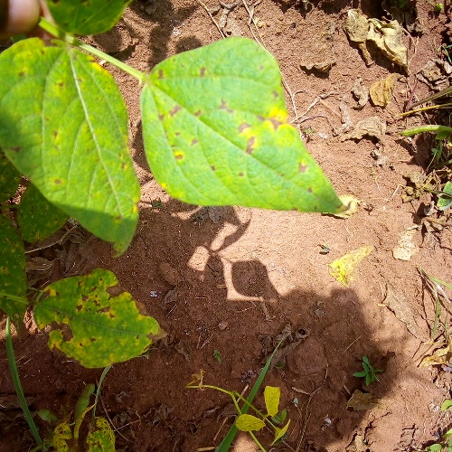

# Image Classification with Pretrained Models

This project demonstrates how to use a pretrained GoogleNet model for image classification. The workflow includes data preprocessing, model customization, training, and evaluation. The implementation is done in PyTorch, and the dataset is structured for training and validation.

## Workflow Overview

### 1. Import Required Libraries
The notebook begins by importing essential libraries such as PyTorch, torchvision, pandas, and matplotlib. These libraries are used for data handling, transformations, and model training.

### 2. Dataset Preparation
- **Dataset Structure**: The dataset is divided into training and validation sets, with images organized in folders.
- **CSV Files**: `train.csv` and `val.csv` contain the relative paths to the images and their corresponding labels.
- **Custom Dataset Class**: A `CustomDataset` class is implemented to load images and apply transformations such as resizing and normalization.

### 3. Data Loading
- **DataLoader**: PyTorch's `DataLoader` is used to create batches of data for training and validation.
- **Transformations**: Images are resized to 128x128 pixels and converted to tensors.

### 4. Model Customization
- **Pretrained GoogleNet**: The pretrained GoogleNet model is loaded, and its fully connected layer is replaced to match the number of classes in the dataset.
- **Device Configuration**: The model is moved to GPU if available.

### 5. Training Configuration
- **Hyperparameters**: Learning rate, batch size, and the number of epochs are defined.
- **Loss Function**: Cross-entropy loss is used.
- **Optimizer**: Adam optimizer is configured with weight decay.

### 6. Training and Validation Loop
- **Training**: The model is trained using the training dataset. Loss and accuracy are calculated for each epoch.
- **Validation**: The model is evaluated on the validation dataset to monitor performance.
- **Metrics**: Training and validation loss and accuracy are printed for each epoch.

### 7. Results
- **Plots**: Loss and accuracy trends for training and validation are plotted.
- **Model Evaluation**: The final model performance is evaluated on the validation dataset.

## File Structure
- `img_class_pretrain.ipynb`: The main notebook containing the implementation.
- `train.csv` and `val.csv`: CSV files with image paths and labels.
- `archive01/`: Directory containing the dataset.

## Notes
- Ensure the dataset paths in `train.csv` and `val.csv` are correct.
- Modify the `root_dir` variable in the notebook to point to the dataset location.

## Acknowledgments
- Pretrained GoogleNet model from PyTorch's `torchvision.models`.
- Dataset structure inspired by common practices in image classification tasks.

## Dataset Visualization

To visualize the images in the dataset located at `/home/adityaraut/Documents/Machine-Learning-FCC/dl_fcc/bean_leaf`, you can use the following Python code snippet:

```python
import os
import matplotlib.pyplot as plt
from PIL import Image

# Path to the dataset
dataset_path = "/home/adityaraut/Documents/Machine-Learning-FCC/dl_fcc/bean_leaf"

# Display a few sample images
sample_images = os.listdir(dataset_path)[:5]  # Adjust the number of images to display

plt.figure(figsize=(10, 10))
for i, image_name in enumerate(sample_images):
    image_path = os.path.join(dataset_path, image_name)
    image = Image.open(image_path)
    
    plt.subplot(1, len(sample_images), i + 1)
    plt.imshow(image)
    plt.axis('off')
    plt.title(image_name)

plt.show()
```

This code will display a few sample images from the dataset for quick visualization. Ensure that the dataset path is correct and contains image files.

## Dataset Images

Below are some sample images from the dataset located at `/home/adityaraut/Documents/Machine-Learning-FCC/dl_fcc/bean_leaf`:




.jpg)
.jpg)